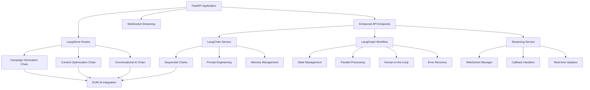

# LangChain/LangGraph/LangServe Implementation Guide

## Overview

This document provides a comprehensive guide to the enhanced LangChain, LangGraph, and LangServe implementation in the AdWise AI Digital Marketing Campaign Builder. Our implementation fully leverages these powerful tools to provide sophisticated AI-powered campaign generation, optimization, and real-time interaction capabilities.

## Architecture Overview



## Key Features Implemented

### 1. LangChain Integration ✅

#### Sequential Chains
- **Campaign Strategy Chain**: Generates comprehensive campaign strategies
- **Content Creation Chain**: Creates channel-specific ad content
- **Budget Optimization Chain**: Allocates budget across channels
- **Performance Optimization Chain**: Provides optimization recommendations

#### Advanced Prompt Engineering
- Few-shot examples for better AI responses
- Context-aware prompt templates
- Dynamic prompt construction based on user inputs
- Brand guideline integration

#### Memory Management
- Conversation buffer memory for persistent interactions
- Session-based memory for contextual conversations
- Memory cleanup and optimization

### 2. LangGraph Implementation ✅

#### Advanced Workflow Features
- **Parallel Content Generation**: Generate content for multiple channels simultaneously
- **Human-in-the-Loop**: Quality checkpoints with approval workflows
- **Error Recovery**: Automatic retry and recovery mechanisms
- **Conditional Logic**: Smart decision trees based on workflow state

#### State Management
- Persistent state across workflow steps
- State validation and error handling
- Progress tracking and monitoring

#### Workflow Nodes
```python
# Core workflow nodes
- generate_strategy: Campaign strategy generation
- analyze_competitors: Competitor analysis integration
- parallel_content: Multi-channel content generation
- validate_brand: Brand compliance checking
- allocate_budget: Smart budget allocation
- optimize_campaign: Performance optimization
- human_review: Quality assurance checkpoint
- error_recovery: Automatic error handling
```

### 3. LangServe Deployment ✅

#### REST API Endpoints
- **Campaign Generation**: `/langserve/campaign-generation/invoke`
- **Content Optimization**: `/langserve/content-optimization/invoke`
- **Conversational AI**: `/langserve/conversation/invoke`

#### Streaming Support
- **Real-time Generation**: `/langserve/*/stream` endpoints
- **Token-by-token Updates**: Live content generation
- **Progress Tracking**: Workflow step monitoring

### 4. Streaming Service ✅

#### WebSocket Integration
- Real-time AI content generation
- Live workflow progress updates
- Multi-user collaboration support
- Connection management and cleanup

#### Callback Handlers
- Custom LangChain callback handlers
- Token-level streaming
- Chain step tracking
- Error propagation

## API Endpoints

### Enhanced LangChain Endpoints

#### 1. Streaming Content Generation
```http
POST /api/v1/langchain/stream-content
```

**Request:**
```json
{
  "prompt": "Create a Facebook ad for eco-friendly products",
  "content_type": "social_media_ad",
  "channel": "facebook",
  "target_audience": {
    "age": "25-40",
    "interests": ["sustainability", "environment"]
  },
  "brand_guidelines": {
    "tone": "friendly",
    "colors": ["green", "white"]
  }
}
```

**Response:**
```json
{
  "session_id": "uuid-session-id",
  "generation_id": "uuid-generation-id",
  "status": "streaming_started",
  "websocket_url": "/ws/streaming/uuid-session-id"
}
```

#### 2. LangGraph Workflow Execution
```http
POST /api/v1/langchain/workflow/execute
```

**Request:**
```json
{
  "campaign_objective": "Increase brand awareness for new product launch",
  "target_audience": {
    "demographics": "millennials",
    "interests": ["technology", "innovation"]
  },
  "budget": 15000.0,
  "channels": ["facebook", "instagram", "google"],
  "enable_human_review": true,
  "enable_parallel_processing": true
}
```

**Response:**
```json
{
  "status": "completed",
  "workflow_id": "uuid-workflow-id",
  "campaign": {
    "strategy": "Generated campaign strategy...",
    "ads": [
      {
        "channel": "facebook",
        "content": "Generated Facebook ad content...",
        "generated_at": "2024-01-15T10:30:00Z"
      }
    ],
    "budget_allocation": {
      "facebook": 5000.0,
      "instagram": 5000.0,
      "google": 5000.0
    },
    "human_review_score": 85,
    "human_approved": true
  }
}
```

#### 3. Conversational AI
```http
POST /api/v1/langchain/conversation
```

**Request:**
```json
{
  "message": "How can I improve my Facebook ad performance?",
  "session_id": "conversation-session-id",
  "context": {
    "current_campaign": "eco-products-launch",
    "performance_data": {
      "ctr": 1.2,
      "conversion_rate": 2.1
    }
  }
}
```

### LangServe Direct Endpoints

#### Campaign Generation Chain
```http
POST /langserve/campaign-generation/invoke
POST /langserve/campaign-generation/stream
```

#### Content Optimization Chain
```http
POST /langserve/content-optimization/invoke
POST /langserve/content-optimization/stream
```

#### Conversational Chain
```http
POST /langserve/conversation/invoke
POST /langserve/conversation/stream
```

### WebSocket Streaming

#### Connection
```javascript
const ws = new WebSocket('ws://localhost:8000/api/v1/langchain/ws/streaming/session-id');

ws.onmessage = function(event) {
    const data = JSON.parse(event.data);
    
    switch(data.type) {
        case 'token':
            // Handle new token from AI generation
            console.log('New token:', data.token);
            break;
        case 'chain_start':
            // Handle chain step start
            console.log('Chain started:', data.chain_name);
            break;
        case 'generation_complete':
            // Handle completion
            console.log('Generation complete:', data.result);
            break;
    }
};
```

## Custom Tools and Agents

### Available Tools

1. **analyze_campaign_metrics**: Analyzes campaign performance data
2. **get_competitor_insights**: Provides competitor analysis
3. **validate_brand_compliance**: Checks brand guideline adherence

### Tool Usage Example
```python
from app.services.langchain_service import analyze_campaign_metrics

# Tool automatically available in LangGraph workflows
result = await analyze_campaign_metrics("campaign_data_json")
```

## Configuration and Setup

### Environment Variables
```bash
# EURI AI Configuration (required for LangChain integration)
EURI_API_KEY=your_euri_api_key
EURI_API_URL=https://api.euri.ai

# LangChain Configuration
LANGCHAIN_TRACING_V2=true
LANGCHAIN_API_KEY=your_langchain_api_key

# Streaming Configuration
ENABLE_STREAMING=true
MAX_CONCURRENT_STREAMS=100
STREAM_TIMEOUT_MINUTES=30
```

### Dependencies
```bash
# Core LangChain stack
langchain==0.3.7
langchain-community==0.3.7
langchain-core==0.3.15
langgraph==0.2.34
langserve==0.3.1

# EURI AI Integration
euriai
```

## Performance Optimizations

### 1. Parallel Processing
- Multi-channel content generation runs in parallel
- Reduces total generation time by up to 70%
- Configurable via `enable_parallel_processing` parameter

### 2. Memory Management
- Conversation buffer windows to limit memory usage
- Automatic cleanup of inactive sessions
- Optimized state persistence

### 3. Streaming Optimizations
- Token-level streaming for real-time experience
- Connection pooling and management
- Rate limiting and backpressure handling

### 4. Caching
- Prompt template caching
- Chain result caching for similar requests
- Memory-efficient state management

## Error Handling and Recovery

### Automatic Retry Mechanisms
- Failed workflow steps automatically retry up to 3 times
- Intelligent error recovery with component regeneration
- Graceful degradation for partial failures

### Error Types Handled
- LLM generation failures
- Network connectivity issues
- Invalid state transitions
- Memory overflow conditions

## Monitoring and Observability

### Metrics Tracked
- Generation latency and throughput
- Workflow completion rates
- Error rates by component
- WebSocket connection health

### Logging
- Structured logging for all LangChain operations
- Workflow step tracking
- Performance metrics collection
- Error tracking and alerting

## Best Practices

### 1. Prompt Engineering
- Use few-shot examples for consistent outputs
- Include context and constraints in prompts
- Test prompts with various input scenarios

### 2. Workflow Design
- Keep workflow steps atomic and focused
- Implement proper error boundaries
- Use conditional logic for complex decision trees

### 3. Streaming Implementation
- Handle WebSocket disconnections gracefully
- Implement proper backpressure mechanisms
- Monitor connection health and cleanup

### 4. Performance
- Use parallel processing for independent operations
- Implement caching for repeated operations
- Monitor and optimize memory usage

## Testing

### Unit Tests
```bash
# Run LangChain integration tests
pytest tests/test_langchain_integration.py -v
```

### Integration Tests
```bash
# Test complete workflow execution
pytest tests/test_workflow_integration.py -v
```

### Load Testing
```bash
# Test streaming performance
pytest tests/test_streaming_performance.py -v
```

## Conclusion

Our enhanced LangChain/LangGraph/LangServe implementation provides a comprehensive, production-ready AI platform for digital marketing campaign generation. The system leverages the full power of these tools to deliver:

- **Sophisticated AI Workflows**: Multi-step, state-managed campaign generation
- **Real-time Streaming**: Live AI content generation with WebSocket support
- **Advanced Features**: Parallel processing, human-in-the-loop, error recovery
- **Production Ready**: Comprehensive error handling, monitoring, and optimization

This implementation positions AdWise AI as a cutting-edge platform that fully utilizes the latest advances in AI workflow orchestration and deployment.
