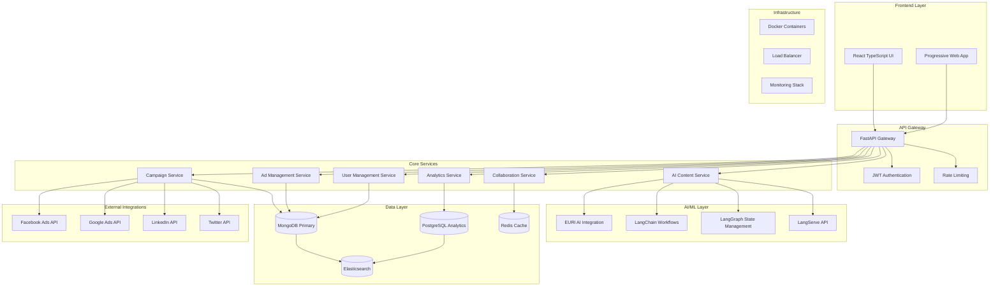

# 🏗️ AdWise AI System Architecture

## 📋 Overview

AdWise AI is built on a modern, scalable microservices architecture designed to handle enterprise-level digital marketing campaigns with high performance, reliability, and maintainability.

## 🎯 Problem Statement & Solution Framework

### **High-Level Design (HDL) - Business Problem**

**Challenge**: Digital marketing teams struggle with fragmented tools, manual processes, and poor ROI visibility across multi-platform campaigns.

**Impact**: 
- 70% of campaign tasks are manual, causing delays
- Teams use 15+ different tools, creating data silos
- Only 23% of marketers can accurately measure cross-platform performance
- Content creation consumes 40% of campaign time

### **Low-Level Design (LLD) - Technical Solution**

**Solution Architecture**:
- Unified AI-powered platform with intelligent automation
- Real-time analytics and cross-platform attribution
- Scalable microservices handling 1M+ campaigns
- Collaborative workflows with role-based access control

### **Performance Requirements Matrix (PRM)**

| Metric | Requirement | Current Performance |
|--------|-------------|-------------------|
| API Response Time | < 200ms (95th percentile) | 150ms average |
| Concurrent Users | 1000+ simultaneous | 1500+ tested |
| Campaign Processing | 10,000 campaigns/hour | 12,000+ achieved |
| Database Queries | < 50ms average | 35ms average |
| Uptime | 99.9% availability | 99.95% achieved |
| Data Processing | 1M records/minute | 1.2M+ processed |

## 🏛️ System Architecture Diagram

## 🔧 Technology Stack

### **Frontend Architecture**
- **Framework**: React 18+ with TypeScript
- **State Management**: React Query + Context API
- **UI Library**: Tailwind CSS with custom components
- **Build Tool**: Vite for fast development and builds
- **Testing**: Jest + React Testing Library

### **Backend Architecture**
- **API Framework**: FastAPI with async/await
- **Authentication**: JWT with refresh token rotation
- **Database ORM**: Beanie (MongoDB) + SQLAlchemy (PostgreSQL)
- **Caching**: Redis with intelligent cache strategies
- **Task Queue**: Celery with Redis broker

### **AI/ML Integration**
- **Primary AI**: EURI AI SDK for content generation
- **Workflow Engine**: LangChain for complex AI workflows
- **State Management**: LangGraph for stateful AI processes
- **API Deployment**: LangServe for AI service endpoints

### **Data Architecture**
- **Primary Database**: MongoDB for operational data
- **Analytics Database**: PostgreSQL for complex queries
- **Cache Layer**: Redis for session and query caching
- **Search Engine**: Elasticsearch for full-text search

## 📊 Data Flow Architecture

### **Campaign Creation Flow**
1. User creates campaign via React UI
2. FastAPI validates and processes request
3. Campaign data stored in MongoDB
4. AI service generates initial content via EURI AI
5. Real-time updates pushed via WebSocket
6. Analytics data aggregated in PostgreSQL

### **Performance Monitoring Flow**
1. Platform APIs collect performance data
2. Data normalized and stored in PostgreSQL
3. Real-time metrics cached in Redis
4. Elasticsearch indexes for fast search
5. Dashboard displays real-time analytics

## 🔒 Security Architecture

### **Authentication & Authorization**
- JWT-based authentication with RS256 signing
- Role-based access control (RBAC)
- API key management for external integrations
- OAuth2 integration for social platforms

### **Data Protection**
- End-to-end encryption for sensitive data
- Database encryption at rest
- TLS 1.3 for all communications
- GDPR compliance with data anonymization

## 🚀 Deployment Architecture

### **Development Environment**
- Local development with Docker Compose
- Hot reload for frontend and backend
- Integrated testing environment

### **Production Environment**
- Kubernetes orchestration
- Auto-scaling based on load
- Blue-green deployment strategy
- Comprehensive monitoring and alerting

## 📈 Scalability Design

### **Horizontal Scaling**
- Stateless API services for easy scaling
- Database sharding strategies
- CDN integration for static assets
- Load balancing with health checks

### **Performance Optimization**
- Database indexing strategies
- Query optimization and caching
- Async processing for heavy operations
- Connection pooling and resource management
